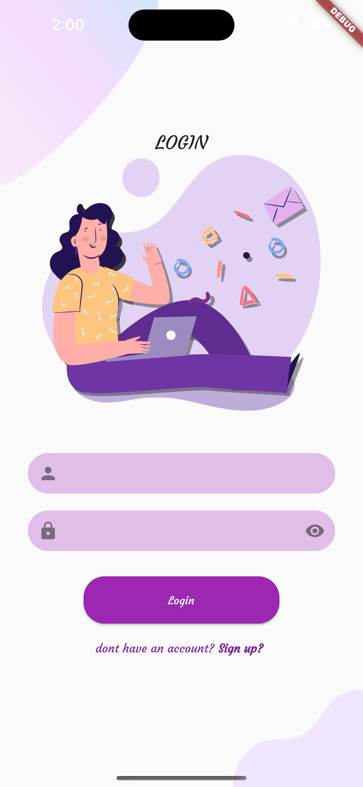
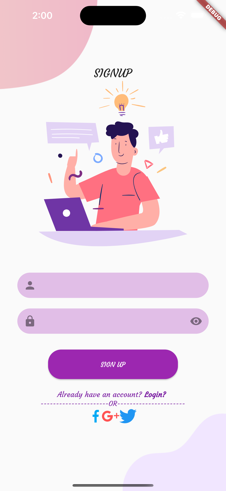

# simple modern app

Try me is a Flutter app built with a modern UI using Flutter's Material Design principles. It includes page index, login, and sign up features, along with various interactive components like buttons and switches. The app is designed to be compatible with screens of all sizes.

## Getting Started

To get started with MyApp, follow these steps:

1. **Clone** this repository to your local machine using `git clone https://github.com/hakimbhb/simple-modern.git`

2. **Install** the required dependencies by running `flutter pub get`
3. **Connect** a device or start an emulator
4. **Run** the app using the command `flutter run`

## Features

- Page Index: Easily navigate between different pages in the app.
- Login: Securely log in to the app using your credentials.
- Sign Up: Create a new account within the app.
- Interactive Components: Use buttons and switches to perform actions and control settings.

## Screenshots

## Dependencies

MyApp relies on the following dependencies:

- flutter: [3.7.13-0.0.pre.1]

## Contributing

If you'd like to contribute to My App, feel free to submit a pull request. Please ensure that you follow the existing code style and conventions.

## Author

 Developed by Hakim Ben Hadj Brahim. You can reach me at
 <bhbhakim001@gmail.com> .

## License

This project is licensed under the MIT Licence. See the `LICENSE` file for more information.
